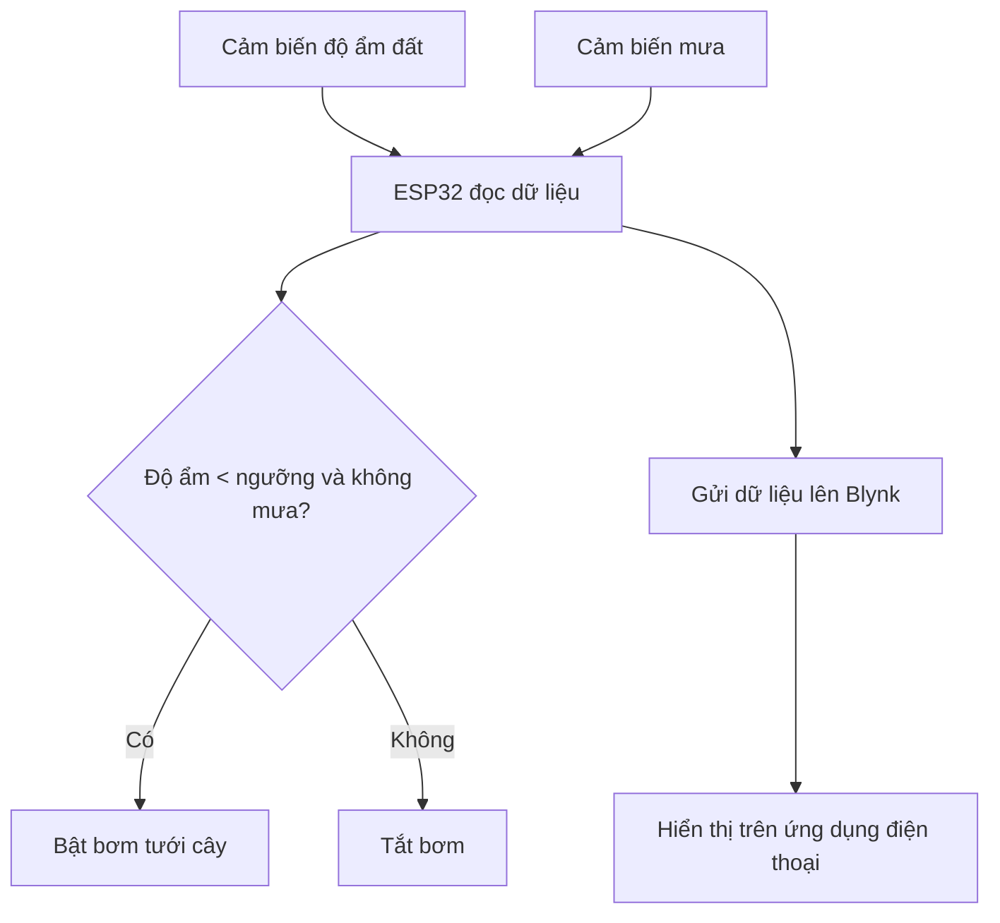

# 💧 HỆ THỐNG TƯỚI CÂY TỰ ĐỘNG SỬ DỤNG ESP32 VÀ ỨNG DỤNG BLYNK

## 📌 1. Giới thiệu chung

Dự án xây dựng một hệ thống **tưới cây tự động thông minh** sử dụng vi điều khiển ESP32 kết hợp với các cảm biến môi trường như cảm biến độ ẩm đất và cảm biến mưa. Hệ thống được điều khiển và giám sát từ xa thông qua **ứng dụng Blynk**, hỗ trợ người dùng kiểm tra thông số thời gian thực và thiết lập ngưỡng độ ẩm cần tưới.

Ứng dụng phù hợp cho các vườn cây nhỏ, vườn trong nhà, hoặc mô hình nông nghiệp học đường.

---

## 📊 2. Sơ đồ hệ thống và chức năng

### 🛠️ **Sơ đồ hoạt động:**



### ✅ **Chức năng chính:**
- Đọc độ ẩm đất và tình trạng mưa
- Tự động bật/tắt bơm tưới
- Thiết lập ngưỡng độ ẩm từ xa (qua Blynk)
- Hiển thị dữ liệu cảm biến theo thời gian thực
- Giao diện người dùng trực quan trên Blynk App

---

## 💡 3. Công nghệ và kỹ thuật sử dụng

- **Phần cứng:**
  - ESP32 DevKit V1
  - Cảm biến độ ẩm đất (analog)
  - Cảm biến mưa (analog hoặc digital)
  - Relay và bơm mini
  - Dây điện, breadboard, nguồn phụ

- **Phần mềm:**
  - Arduino IDE
  - Blynk IoT Platform (App trên điện thoại)

- **Thư viện:**
  - `WiFi.h`
  - `BlynkSimpleEsp32.h`

- **Biến ảo sử dụng trên Blynk:**
  - `V0`: Hiển thị độ ẩm đất
  - `V1`: Hiển thị cảm biến mưa
  - `V2`: Thiết lập ngưỡng độ ẩm

---

## 📱 4. Giao diện ứng dụng Blynk

| Ảnh giao diện thực tế từ Blynk |
|-------------------------------|
|  | https://drive.google.com/drive/folders/1RV0GDqeRAk0keeznIpKTNl2IP6W17Cis?usp=drive_link

---

## ⚙️ 5. Cài đặt và sử dụng

### A. Kết nối phần cứng
- SOIL_SENSOR_PIN → GPIO34  
- RAIN_SENSOR_PIN → GPIO35  
- Relay điều khiển bơm → GPIO27

### B. Thiết lập trên Arduino IDE
1. Cài thư viện Blynk (`Blynk` & `BlynkSimpleEsp32`)
2. Điền `BLYNK_AUTH_TOKEN`, WiFi SSID và pass vào code
3. Nạp code vào ESP32

### C. Cấu hình App Blynk:
1. Tạo project mới (Blynk IoT)
2. Thêm các widget:
   - **Gauge V0** – Hiển thị độ ẩm đất
   - **Gauge V1** – Hiển thị cảm biến mưa
   - **Step Slider V2** – Cài đặt ngưỡng độ ẩm
   - **Button** – Có thể thêm để bật/tắt bơm thủ công (nếu cần)
3. Liên kết với thiết bị ESP32 sử dụng template ID/token tương ứng

---

## 📁 6. Cấu trúc thư mục

```
📦 smart-irrigation-blynk/
├── codethi.ino
├── README.md
└── blynk_interface.jpg
```

---

## 📞 7. Liên hệ

- Tác giả: [Lê Xuân Đạt]
- Email: brianbenn2003@gmail.com
